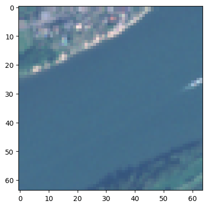

fastai-torchgeo
================

<!-- WARNING: THIS FILE WAS AUTOGENERATED! DO NOT EDIT! -->

<div>

[](https://colab.research.google.com/github/butchland/fastai-torchgeo/blob/master/nbs/index.ipynb)

</div>

A [fastai](https://docs.fast.ai) extension to use the
[torchgeo](https://torchgeo.readthedocs.io/en/stable/) models and
datasets

## Installation

``` bash
pip install git+https://github.com/butchland/fastai-torchgeo.git
```

## General Information

`fastai-torchgeo` provides adapters and utilities to enable the
`torchgeo` package to be used alongside `fastai`. The goal is make it
easier to use `fastai` for geospatial machine learning.

In addition to the utilities, we also provide examples of how to
integrate `torchgeo` datasets and models into `fastai` workflows, such
as EDA, training and inference.

Each of `fastai-torchgeo` modules have their own page and you are
encouraged to browse through them as they also provide usage examples.

To get a quick taste of what this package can do, take a look at the
examples below.

> **Note**: All the pages in this site are written as jupyter notebooks
> that can be run on [Google Colab](https://colab.research.google.com).
> Just click on the
> [](https://colab.research.google.com/github/butchland/fastai-torchgeo/blob/master/nbs/index.ipynb)
> button near the top of each notebook (*including this one!*).

## Examples

### Loading a tif file

``` python
from torchgeo.datasets import EuroSAT100
import fastai.vision.all as fv

# load a sample geotiff dataset
sat_path = fv.untar_data(EuroSAT100.url)
sat_images = fv.get_image_files(sat_path)
sat_image = sat_images[15]; sat_image
```

    Path('/home/butch2/.fastai/data/EuroSAT100/images/remote_sensing/otherDatasets/sentinel_2/tif/River/River_458.tif')

``` python
from fastai_torchgeo.core import load_tif, open_tif, GeoTensorImage

arr = load_tif(sat_image) 
(type(arr),arr.shape) # ndarray, (height,width, channels)
```

    (numpy.ndarray, (64, 64, 13))

``` python
# load sat image as tensor
t_img = open_tif(sat_image)
(type(t_img), t_img.shape)
```

    (torch.Tensor, torch.Size([64, 64, 13]))

``` python
geo_t = GeoTensorImage.create(sat_image)
(type(geo_t), geo_t.shape)
```

    (fastai_torchgeo.core.GeoTensorImage, torch.Size([13, 64, 64]))

### Showing geo tensor images

``` python
geo_t.show();
```


